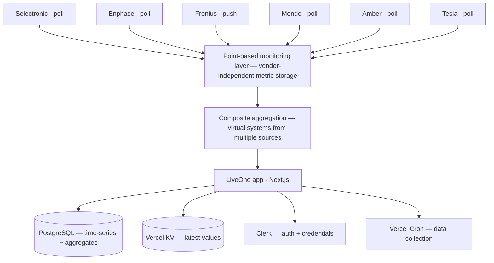

# LiveOne

**Universal, multi-user solar and energy monitoring.**

LiveOne brings every part of your energy system into one live dashboard — solar inverters, batteries, the grid, your electricity retailer, and even your EV — no matter the brand. Watch power flow through your home in real time, explore historical patterns, and combine systems across sites and vendors into a single unified view.

It works with any hardware because every metric is stored as a generic "point" rather than a vendor-specific field — so adding a new device or brand never requires a schema change.

## Features

### Live monitoring

- Real-time power cards for solar, battery, grid, and load
- Auto-refresh as new data arrives, with clear status and fault indicators
- Battery state-of-charge tracking with min / average / max trends

### Visualizations

- **Energy-flow Sankey** — an interactive diagram showing power flowing between solar, battery, grid, and load in real time
- **Heatmaps** — a calendar-style grid revealing daily patterns and trends for any metric over time
- **Multi-resolution charts** — switch between 5-minute, 30-minute, and daily views
- **Energy statistics** — today, yesterday, and all-time summaries, with a power/energy (kW ↔ kWh) toggle

### Electricity pricing

- Live Amber Electric wholesale price data, kept current and shown alongside your usage

### Multi-user and multi-system

- Unlimited users, each with their own systems
- Multiple systems per account, with owner and viewer roles
- URL-friendly system aliases for easy bookmarking and sharing
- Secure authentication via Clerk

### Composite (virtual) systems

Combine several physical systems — even different brands at different locations — into one virtual system. For example, pull battery and load from a Selectronic at one site and solar from an Enphase at another, and see them as a single property-wide view.

### Sharing

- View-only share links with configurable expiry and one-click revocation
- Public pages for showcasing specific installations

### Admin

- Cross-user overview of every system with live status and polling health
- User administration and access management
- Storage and database analytics
- One-click connection testing for vendor credentials

## Supported systems

| System             | Method                   | Update frequency             |
| ------------------ | ------------------------ | ---------------------------- |
| Selectronic SP PRO | Select.Live API (poll)   | ~1 minute                    |
| Enphase IQ         | OAuth 2.0 API (poll)     | Hourly, daylight hours only  |
| Fronius            | FroniusPusher (push)     | Real-time push               |
| Mondo Power        | Direct API (poll)        | ~2 minutes                   |
| Amber Electric     | Retailer API (poll)      | ~5 minutes                   |
| Tesla              | Fleet / Owner API (poll) | 15 min (5 min when charging) |
| Composite          | Virtual aggregation      | Derived from sources         |

Polling adapts to the source: Enphase skips overnight, and Tesla speeds up while a vehicle is charging.

## Architecture

Every reading from every vendor is normalized into a **point** — a single metric stream identified by system and point ID. Because points are generic, LiveOne supports any vendor with any set of metrics, and adding a new integration is just a new adapter, never a database change. Composite systems are built by aggregating points from other systems.

Data flows through a clear pipeline: **collect** from vendor APIs (polled or pushed) → **publish** as durable messages → **materialise** into the database through a single idempotent writer → **aggregate** into 5-minute and daily roll-ups → **serve** to dashboards, with the latest values cached for sub-100ms reads.



### Tech stack

- **Frontend** — Next.js 15 (App Router), TypeScript, Tailwind CSS
- **Backend** — Vercel serverless functions, region `syd1` (Sydney)
- **Database** — PostgreSQL on PlanetScale, via Drizzle ORM
- **Cache** — Vercel KV (Upstash Redis) for latest point values
- **Queue** — Upstash QStash for durable observation delivery
- **Auth** — Clerk (multi-user; vendor credentials stored in Clerk, never in the database)
- **Visualization** — Recharts, D3 Sankey, and Chart.js
- **Collection** — Vercel Cron (minutely polling, daily aggregation)

For the full picture, see [`docs/architecture/overview.md`](docs/architecture/overview.md) and the [documentation index](docs/README.md).

## Getting started

**Prerequisites:** Node.js 18+, plus accounts for Clerk (auth), PlanetScale (Postgres), and Vercel (hosting). A Vercel KV cache is recommended but optional.

```bash
git clone https://github.com/simonhac/liveone.git
cd liveone
npm install
cp .env.example .env.local   # fill in Clerk, database, and KV credentials
npm run dev
```

Then visit [http://localhost:3000](http://localhost:3000).

Configuration, environment variables, and deployment to Vercel (including cron setup) are documented in [`docs/`](docs/README.md).

## Documentation

- [Documentation index](docs/README.md) — start here
- [Architecture overview](docs/architecture/overview.md) — stack, data path, and glossary
- [Data model](docs/architecture/data-model.md) — semantics and invariants
- [API reference](docs/architecture/api.md) — conventions and route inventory
- [Point-based monitoring](docs/architecture/points.md) — the core data model in depth

## License

MIT License.
