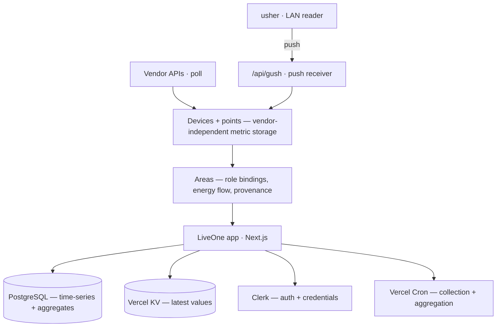

# LiveOne

**Universal, multi-user solar and energy monitoring.**

LiveOne brings every part of your energy system into one live dashboard — solar inverters, batteries, the grid, generators, your electricity retailer, and even your EV — no matter the brand. Watch power flow through your home in real time, explore historical patterns, and combine devices across sites and vendors into a single unified view.

It works with any hardware because every metric is stored as a generic "point" rather than a vendor-specific field — so adding a new device or brand never requires a schema change.

## Features

### Live monitoring

- Real-time power cards for solar, battery, grid, and load
- Auto-refresh as new data arrives, with clear status and fault indicators
- Battery state-of-charge tracking with min / average / max trends

### Visualizations

- **Energy-flow Sankey** — an interactive diagram showing power flowing between solar, battery, grid, and load in real time
- **Heatmaps** — a calendar-style grid revealing daily patterns and trends for any metric over time
- **Time travel** — switch between day, week, month and year, and step back through history; every chart, the Sankey and the legend stay in sync on one shared window and focused moment
- **Multi-resolution data** — 5-minute, 30-minute, and daily roll-ups, selected automatically to suit the window
- **Energy statistics** — today, yesterday, and all-time summaries, with a power/energy (kW ↔ kWh) toggle

### Electricity pricing and grid signals

- Live Amber Electric wholesale price data, kept current and shown alongside your usage
- Live NEM grid signals from OpenElectricity — spot price, emissions intensity, renewable proportion and operational demand for your region

### Energy provenance

- **Battery contents** — the carbon, cost and renewable content of the energy currently stored in your battery, tracked as a blended inventory that accumulates on charge and is vended on discharge
- **Attributed flows** — every source→load edge carries emissions, renewable and cost alongside energy, so the Sankey, tooltips and chart legends all agree
- **Home Energy** — consumption rate, emissions intensity, renewable share and own-generation ratios for the selected period

### Run tracking

- Automatic detection of device run periods (a generator start/stop, a hot-water heat-pump cycle) from any signal, with duration, energy and per-run cost/emissions
- Derived metrics — such as a modelled hot-water temperature — are stored as ordinary points, so they chart and share like any other metric

### Multi-user, devices and areas

- Unlimited users, each with their own devices
- **Areas** group 1..N devices into one semantic view — even different brands at different locations. Pull battery and load from a Selectronic at one site and solar from an Enphase at another, and see them as a single property-wide view
- **Dashboards** are owned by users rather than devices, and compose cards from any area you can read
- URL-friendly aliases for easy bookmarking and sharing
- Secure authentication via Clerk

### Sharing

- View-only share links with configurable expiry and one-click revocation
- Invite others to a dashboard as an admin or viewer
- Public pages for showcasing specific installations

### Admin

- Cross-user overview of every device with live status and polling health
- Device, area and dashboard administration, plus access management
- Live ingest-queue and session inspection
- One-click connection testing for vendor credentials

### Self-healing

- Weekly coverage repair automatically finds and backfills data gaps for vendors that can be re-fetched
- Late-settling data (retailer prices, grid figures) is re-materialised until the day is final

## Supported systems

| System                       | Method                 | Update frequency                     |
| ---------------------------- | ---------------------- | ------------------------------------ |
| Selectronic SP PRO           | Select.Live API (poll) | ~1 minute                            |
| Enphase IQ                   | OAuth 2.0 API (poll)   | Hourly, daylight hours only          |
| Mondo Power                  | Direct API (poll)      | ~2 minutes                           |
| Amber Electric               | Retailer API (poll)    | ~5 minutes                           |
| Sigenergy                    | Cloud API (poll)       | ~5 minutes (+ daily energy backfill) |
| Tesla                        | Fleet API (poll)       | 15 min (5 min when charging)         |
| OpenElectricity (NEM)        | Public API (poll)      | ~5 minutes                           |
| Fronius (`fusher`)           | usher → gusher (push)  | ~1 minute                            |
| Deep Sea DSE7410 (`deepsea`) | usher → gusher (push)  | 1 min running / 5 min idle           |
| `helper`                     | Derived (never polled) | Computed from an area's own points   |

Polling adapts to the source: Enphase skips overnight, Tesla speeds up while a vehicle is charging, and OpenElectricity tracks the NEM's actual publication timing.

**Push vendors** are hardware that is not reachable from the cloud. A local reader (**usher**, in `packages/usher`) polls the device over its LAN protocol — Modbus TCP for the Deep Sea generator controller, the local API for Fronius — and pushes self-describing readings to the `/api/gush` receiver, journalling and spooling to disk so a network or server outage cannot lose a batch.

`helper` is not a vendor at all: it is a derived, never-polled device that lives inside an area and owns that area's computed points (battery-provenance blends, learned battery parameters).

## Architecture

LiveOne is built in three layers:

- **Physical** — **devices** and their **points**. Every reading from every vendor is normalized into a point: a single metric stream with its own stable identity. Because points are generic, LiveOne supports any vendor with any set of metrics, and adding a new integration is just a new adapter, never a database change.
- **Semantic** — **areas**. An area groups 1..N member devices and binds roles (solar, battery, grid, load, EV) to specific points, which is what makes energy flow, provenance and run tracking computable regardless of brand.
- **Presentation** — **dashboards**, stored as a document of nested cards and tiles that reference areas. A dashboard is owned by a user, not a device.

Data flows through a clear pipeline: **collect** from vendor APIs (polled or pushed) → **publish** as durable messages, teed into a Postgres outbox so a poll can never be lost → **materialise** into the database through a single idempotent writer → **aggregate** into 5-minute and daily roll-ups, plus attributed daily flow matrices → **serve** to dashboards, with the latest values cached for sub-100ms reads.


```mermaid
flowchart TD
    POLL[Vendor APIs · poll]
    USH[usher · LAN reader]

    USH -->|push| GUSH["/api/gush · push receiver"]

    POLL --> POINTS
    GUSH --> POINTS

    POINTS[Devices + points — vendor-independent metric storage]
    POINTS --> AREAS[Areas — role bindings, energy flow, provenance]
    AREAS --> APP[LiveOne app · Next.js]

    APP --> PG[(PostgreSQL — time-series + aggregates)]
    APP --> KV[(Vercel KV — latest values)]
    APP --> CLERK[Clerk — auth + credentials]
    APP --> CRON[Vercel Cron — collection + aggregation]
```

### Tech stack

- **Frontend** — Next.js 15 (App Router), TypeScript, Tailwind CSS
- **Backend** — Vercel serverless functions, region `syd1` (Sydney)
- **Database** — PostgreSQL on PlanetScale, via Drizzle ORM
- **Cache** — Vercel KV (Upstash Redis) for latest point values
- **Queue** — Upstash QStash for durable observation delivery
- **Auth** — Clerk (multi-user; vendor credentials stored in Clerk, never in the database)
- **Data layer** — TanStack React Query v5, with SSR prefetch and hydration
- **Visualization** — Chart.js (time-series, heatmap) and modular d3 (Sankey, scales, palettes)
- **Collection** — Vercel Cron (minutely polling, daily aggregation, weekly coverage repair); LAN devices via `packages/usher` on a Fly WireGuard hub

For the full picture, see [`docs/architecture/overview.md`](docs/architecture/overview.md) and the [documentation index](docs/README.md).

## Getting started

**Prerequisites:** Node.js 22 (pinned in `.nvmrc`), plus accounts for Clerk (auth), PlanetScale (Postgres), and Vercel (hosting). Vercel KV holds the latest point values: without it the app starts and historical charts work, but live values are unavailable (the cache logs a warning and does not function).

```bash
git clone https://github.com/simonhac/liveone.git
cd liveone
npm install
cp .env.tpl .env.local   # then fill in Clerk, database, and KV credentials
npm run dev
```

`.env.tpl` is the committed, secret-free list of every variable the app needs; each value is a 1Password reference. Maintainers with vault access can populate it in one step with `op inject -i .env.tpl -o .env.local`; everyone else should replace the references with their own credentials by hand.

Then visit [http://localhost:3000](http://localhost:3000).

Configuration, environment variables, and deployment to Vercel (including cron setup) are documented in [`docs/`](docs/README.md).

## Documentation

- [Documentation index](docs/README.md) — start here
- [Architecture overview](docs/architecture/overview.md) — stack, data path, and glossary
- [Data model](docs/architecture/data-model.md) — semantics and invariants, including the point model (paths, metric types, identity)
- [API reference](docs/architecture/api.md) — conventions and external contracts
- [Areas and dashboards](docs/architecture/areas-and-dashboards.md) — the semantic and presentation layers
- [Battery provenance](docs/architecture/battery-provenance.md) — how stored energy carries carbon, cost and renewable content
- [Adding a vendor](docs/devices/README.md) — the anatomy of an integration
- [Project history](docs/project-history.md) — the chronological record

## License

MIT License.
