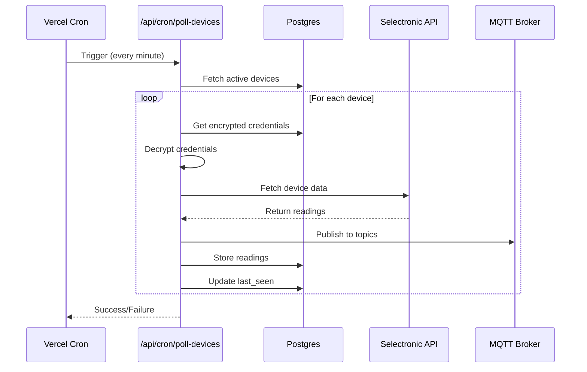

# LiveOne Architecture Documentation

## System Overview

LiveOne is a serverless web application that bridges Selectronic SP PRO inverters to MQTT, deployed entirely on Vercel's platform with minimal external dependencies.

## Core Architecture Principles

1. **Serverless First**: Leverage Vercel's serverless functions for all compute
2. **Event-Driven**: Use cron jobs for polling, webhooks for updates
3. **Stateless Operations**: No persistent processes or connections
4. **Security by Design**: Encrypted credentials, authenticated endpoints
5. **Scalable by Default**: Automatic scaling with Vercel's infrastructure

## System Components

### 1. Web Application (Vercel)

```
┌─────────────────────────────────────────────────┐
│                 Next.js Application              │
├─────────────────────────────────────────────────┤
│  Frontend (React)                                │
│  ├── Pages (App Router)                         │
│  │   ├── / (Landing)                            │
│  │   ├── /auth/* (Login/Register)               │
│  │   ├── /dashboard (Main UI)                   │
│  │   ├── /devices/* (Device Management)         │
│  │   └── /settings (User Settings)              │
│  ├── Components                                  │
│  │   ├── UI (shadcn/ui)                        │
│  │   ├── Charts (Recharts)                     │
│  │   └── Forms (react-hook-form)               │
│  └── Hooks                                      │
│      ├── useAuth()                             │
│      ├── useDevices()                          │
│      └── useRealtime()                         │
├─────────────────────────────────────────────────┤
│  API Routes (Serverless Functions)              │
│  ├── /api/auth/* (NextAuth.js)                 │
│  ├── /api/devices/* (CRUD)                     │
│  ├── /api/data/* (Metrics)                     │
│  ├── /api/mqtt/* (Publishing)                  │
│  └── /api/cron/poll-devices (Scheduled)        │
├─────────────────────────────────────────────────┤
│  Middleware                                      │
│  ├── Authentication                             │
│  ├── Rate Limiting                              │
│  └── Error Handling                             │
└─────────────────────────────────────────────────┘
```

### 2. Database Layer (Vercel Postgres)

```sql
-- Core Tables
users (
  id UUID PRIMARY KEY,
  email VARCHAR UNIQUE,
  name VARCHAR,
  password_hash VARCHAR,
  email_verified BOOLEAN,
  created_at TIMESTAMP,
  updated_at TIMESTAMP
)

devices (
  id UUID PRIMARY KEY,
  user_id UUID REFERENCES users,
  name VARCHAR,
  serial_number VARCHAR,
  encrypted_credentials JSONB,
  settings JSONB,
  last_seen TIMESTAMP,
  created_at TIMESTAMP,
  updated_at TIMESTAMP
)

readings (
  id UUID PRIMARY KEY,
  device_id UUID REFERENCES devices,
  timestamp TIMESTAMP,
  data JSONB,
  INDEX idx_device_timestamp (device_id, timestamp DESC)
)

connection_logs (
  id UUID PRIMARY KEY,
  device_id UUID REFERENCES devices,
  status VARCHAR,
  error_message TEXT,
  response_time_ms INTEGER,
  timestamp TIMESTAMP,
  INDEX idx_device_timestamp (device_id, timestamp DESC)
)

-- NextAuth Tables
accounts (...)
sessions (...)
verification_tokens (...)
```

### 3. Background Processing (Vercel Cron)



### 4. External Services

#### MQTT Broker (HiveMQ Cloud)
- **Purpose**: Message broker for IoT data
- **Connection**: TLS-secured WebSocket/TCP
- **Topics**: Hierarchical structure per user/device
- **Retention**: Configurable per topic
- **Access**: Username/password authentication

#### Selectronic Live API
- **Purpose**: Source of inverter data
- **Authentication**: Username/password per device
- **Rate Limits**: Unknown (implement backoff)
- **Data Format**: JSON responses
- **Endpoints**:
  - `/api/auth` - Authentication
  - `/api/devices` - Device list
  - `/api/readings` - Current data
  - `/api/history` - Historical data

## Data Flow

### 1. Device Registration Flow
```
User -> Dashboard -> API -> Encrypt Credentials -> Database
                       |-> Test Connection -> Selectronic API
```

### 2. Polling Flow
```
Cron -> Poll Endpoint -> Database (Get Devices)
                     -> Parallel Processing:
                        -> Selectronic API (Fetch Data)
                        -> Transform Data
                        -> MQTT Broker (Publish)
                        -> Database (Store)
```

### 3. Real-time Updates Flow
```
Database -> API -> Server-Sent Events -> Dashboard
                -> WebSocket (fallback) -> Dashboard
                -> Polling (fallback) -> Dashboard
```

## Security Architecture

### Authentication & Authorization
- **User Auth**: NextAuth.js with JWT tokens
- **API Protection**: Middleware validates tokens
- **Device Ownership**: Row-level security in queries
- **Admin Routes**: Role-based access control

### Data Encryption
- **Passwords**: bcrypt hashing (cost factor 12)
- **Device Credentials**: AES-256-GCM encryption
- **API Keys**: Hashed with salt
- **TLS**: All external connections

### Security Headers
```typescript
// Configured in next.config.js
{
  'X-Frame-Options': 'DENY',
  'X-Content-Type-Options': 'nosniff',
  'X-XSS-Protection': '1; mode=block',
  'Referrer-Policy': 'strict-origin-when-cross-origin',
  'Content-Security-Policy': '...'
}
```

## Scalability Considerations

### Vercel Limits (Pro Plan)
- **Function Timeout**: 60 seconds
- **Function Memory**: 3008 MB
- **Cron Frequency**: 1 minute minimum
- **Concurrent Executions**: 1000
- **API Rate Limit**: 5000 req/10s

### Optimization Strategies

#### Batch Processing
```typescript
// Process devices in parallel batches
const BATCH_SIZE = 10;
const batches = chunk(devices, BATCH_SIZE);
for (const batch of batches) {
  await Promise.all(batch.map(processDevice));
}
```

#### Connection Pooling
```typescript
// Reuse database connections
import { Pool } from '@vercel/postgres';
const pool = new Pool({ max: 20 });
```

#### Caching Strategy
```typescript
// Cache device data in Vercel KV
import { kv } from '@vercel/kv';
await kv.set(`device:${id}`, data, { ex: 60 });
```

## Error Handling

### Retry Strategy
```typescript
async function withRetry(fn, maxAttempts = 3) {
  for (let i = 0; i < maxAttempts; i++) {
    try {
      return await fn();
    } catch (error) {
      if (i === maxAttempts - 1) throw error;
      await sleep(Math.pow(2, i) * 1000); // Exponential backoff
    }
  }
}
```

### Circuit Breaker
```typescript
class CircuitBreaker {
  constructor(threshold = 5, timeout = 60000) {
    this.failures = 0;
    this.threshold = threshold;
    this.timeout = timeout;
    this.nextAttempt = Date.now();
  }
  
  async execute(fn) {
    if (Date.now() < this.nextAttempt) {
      throw new Error('Circuit breaker is OPEN');
    }
    
    try {
      const result = await fn();
      this.failures = 0;
      return result;
    } catch (error) {
      this.failures++;
      if (this.failures >= this.threshold) {
        this.nextAttempt = Date.now() + this.timeout;
      }
      throw error;
    }
  }
}
```

## Monitoring & Observability

### Metrics to Track
- **Device Metrics**:
  - Poll success rate
  - Response time
  - Data freshness
  - Error rate by type

- **System Metrics**:
  - Function execution time
  - Database query time
  - MQTT publish success rate
  - API rate limit usage

### Logging Strategy
```typescript
// Structured logging
const logger = {
  info: (msg, meta) => console.log(JSON.stringify({ 
    level: 'info', 
    msg, 
    ...meta, 
    timestamp: new Date().toISOString() 
  })),
  error: (msg, error, meta) => console.error(JSON.stringify({ 
    level: 'error', 
    msg, 
    error: error.message,
    stack: error.stack,
    ...meta, 
    timestamp: new Date().toISOString() 
  }))
};
```

### Health Checks
```typescript
// /api/health endpoint
export async function GET() {
  const checks = {
    database: await checkDatabase(),
    mqtt: await checkMQTT(),
    cron: await checkLastCronRun(),
  };
  
  const healthy = Object.values(checks).every(c => c.status === 'ok');
  
  return Response.json({
    status: healthy ? 'healthy' : 'degraded',
    checks,
    timestamp: new Date().toISOString()
  }, { status: healthy ? 200 : 503 });
}
```

## Development Workflow

### Environment Management
```bash
# Local development
.env.local

# Vercel Preview
.env.preview

# Vercel Production
.env.production
```

### Branch Strategy
- `main` - Production deployment
- `develop` - Preview deployment
- `feature/*` - Feature branches
- `hotfix/*` - Emergency fixes

### CI/CD Pipeline
```yaml
# Automated with Vercel
- Push to GitHub
- Vercel builds preview
- Run tests
- Deploy to preview URL
- Merge to main
- Deploy to production
```

## Cost Optimization

### Vercel Costs
- **Hobby**: $0/month (limited cron)
- **Pro**: $20/month (1-minute cron)
- **Enterprise**: Custom pricing

### Database Costs
- **Vercel Postgres**: Included with Pro
- **Supabase**: Free tier available
- **Neon**: Free tier with 3GB storage

### MQTT Costs
- **HiveMQ Cloud**: Free (100 connections)
- **EMQX Cloud**: Free (100 connections)
- **CloudMQTT**: $5/month minimum

### Optimization Tips
1. Batch database writes
2. Use edge caching where possible
3. Implement request coalescing
4. Archive old data to object storage
5. Use Vercel KV for hot data

## Disaster Recovery

### Backup Strategy
- **Database**: Daily automated backups
- **Credentials**: Encrypted export capability
- **Configuration**: Git version control
- **User Data**: Export functionality

### Recovery Procedures
1. **Database Failure**: Restore from backup
2. **API Outage**: Circuit breaker prevents cascading
3. **MQTT Failure**: Queue messages locally
4. **Credential Loss**: Re-enter via UI

## Future Architecture Considerations

### Horizontal Scaling
- Multiple MQTT brokers with load balancing
- Database read replicas
- CDN for static assets
- Regional deployments

### Advanced Features
- WebSocket server for real-time updates
- Time-series database for metrics
- ML pipeline for predictions
- Event sourcing for audit trail

### Migration Paths
- Kubernetes deployment option
- Self-hosted version
- Multi-cloud support
- On-premise installation