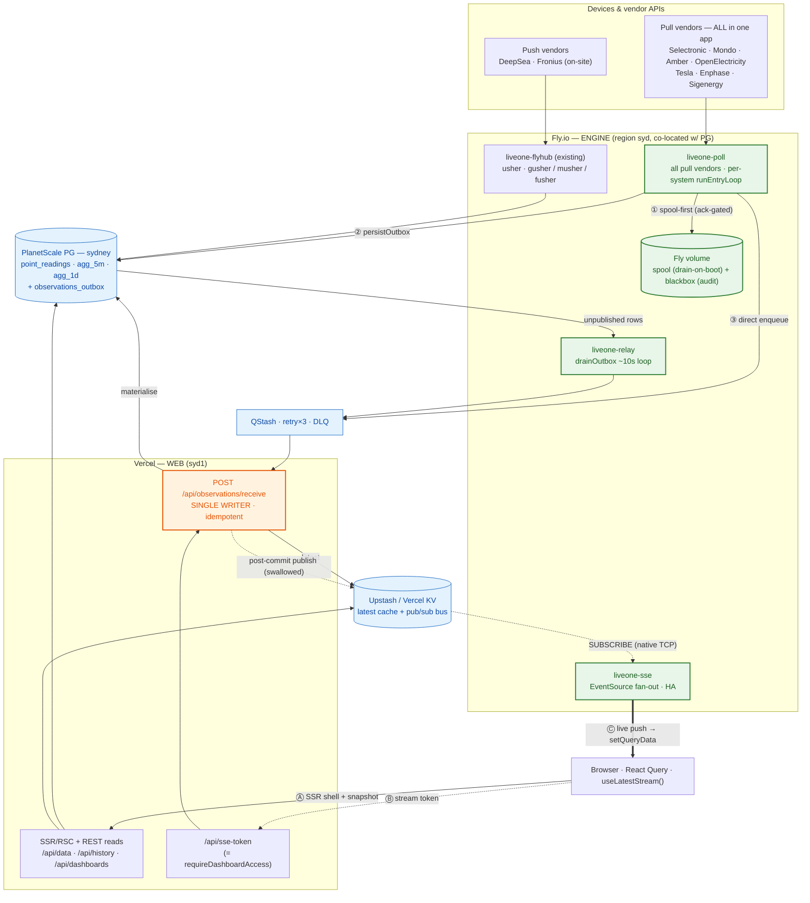

# Live Dashboard: SSR-first load, then engine → Fly + SSE

> Status: proposed — design doc / roadmap. Author-reviewed 2026-07-21.
> Related: [`docs/performance/dashboard-fetch-waterfall.md`](../performance/dashboard-fetch-waterfall.md)
> (the measurements this is built on), [`docs/architecture/engine-web-separation.md`](./engine-web-separation.md).

## Context & motivation

We instrumented the dashboard's fetch waterfall (Server-Timing, PR #198/#199) and measured it from
Italy and from an AWS Lambda **in Sydney (`ap-southeast-2`)**. What we learned:

- **Time-to-fill from a real client is dominated by geography, not our code.** Every request carried
  a ~585 ms `fra1↔syd1` network floor from Italy (`x-vercel-id: fra1::syd1`). From Sydney the same
  routes returned in **~46 ms** (`syd1::syd1`) — a ~13× drop — and **server-side phase times were
  identical across regions** (the function always runs in `syd1`). So network is not ours to fix; the
  levers are structural.
- **~700 ms of the load is client boot** (navigation → first fetch: JS bundle + hydrate) before
  anything data-driven happens — for an AU user that's ~2/3 of a ~1 s settle.
- **The authed page does 6 requests in 2 stages**; the data stage waits client-side for the "chrome"
  stage (`/api/dashboards`, `/api/user/preferences`, `/api/areas/readable`) just to learn the layout.
  The **shared (`?access=`) view already resolves that structure server-side** and skips those three
  requests — proof the fix works.
- **`/api/history` (~198 ms server: `fetch` 82 + `attr` 66) is the real server tail** once network is
  removed.

Two distinct concerns fall out, and they should be built as two lanes:

1. **Initial load** — get *structure* on screen and *values* filled as fast as possible. Fixed by
   **server-side rendering** (Superphase 1). No new infrastructure.
2. **Steady-state liveness** — keep an open page up to date. Fixed by an **SSE push lane** feeding the
   React Query cache. Plus a parallel goal: **move device polling off Vercel onto Fly** for robustness,
   **without ever dropping a poll**.

### Guiding invariants (hold across every phase)

- **Single writer.** `POST /api/observations/receive` is the only writer of the serving store
  (`point_readings` / `agg_5m` / KV latest). Collection never writes it directly.
- **Two lanes, one source of truth.** The SSR snapshot, `/api/data`, and the SSE first-frame all derive
  from the **KV latest cache** — identical shape, so there is no flash at the snapshot→stream handoff.
- **At-least-once + dedupe-at-DB.** Every hop may redeliver; correctness rests on DB unique constraints
  (`point_readings.pr_point_time_unique`, `agg_5m` PK, `observations_outbox (system_id, session_id, seq)`),
  never on exactly-once transport.
- **Durable-before-ack, and retries converge — never corrupt.** A message is only acked once it is in a
  durable store that will *redeliver it*; redelivery/out-of-order must be safe (raw = first-write-wins;
  5m-native & the live stream = last-writer-wins by real `measurementTime`).
- **Reversible.** Every phase is flag-gated and dual-runnable against today's path.

---

## Superphase 1 — SSR-first initial load

**Front-end only. No backend or infra risk. Ships the measured win.** Goal: structure paints at HTML
arrival (not after a ~700 ms boot + three client round-trips), and cards arrive already filled.

### 1.1 Server-render the shell (extend the shared-path resolution to owners)

The shared/grantee path in `app/dashboard/[...slug]/page.tsx` already resolves the v3 descriptor +
referenced Areas **server-side** and ships structure in the initial HTML (that's why the shared view
had ~226 ms boot and zero chrome requests). **Extend that same server resolution to the authed/owner
path** and render card skeletons server-side.

- **Removes from the critical path:** `/api/dashboards`, `/api/user/preferences`, `/api/areas/readable`.
- **Effect:** structure at first paint; **collapses 2 stages → 1** (the data fetches no longer wait
  client-side for the chrome stage).

### 1.2 SSR-prefetch the card data (finish the deferred React Query SSR/hydration)

The RQ migration left SSR prefetch deferred (client-only today). Prefetch `/api/data` (both systems) +
`/api/history` **during render** — the server is in `syd1`, ~0 ms from the data — and hand them down via
a React Query `HydrationBoundary`. The SSR seed *is* the values.

- **Effect:** cards render populated from the initial payload; the client data stage leaves the critical
  path. Don't wait on any network round-trip (or, later, the SSE connection) for first fill.

### 1.3 Precompute / cache `/api/history` (the ~198 ms tail)

`/api/history` (`fetch` 82 ms DB + `attr` 66 ms battery-provenance) is the slowest request and gates
settle. Cache/materialize the sankey + attributed series (derived, largely daily-stable) so it returns
in tens of ms.

- **Effect:** cuts the dominant remaining server cost — for an AU user this *is* the tail.

### Verification

Re-run the harness in [`dashboard-fetch-waterfall.md`](../performance/dashboard-fetch-waterfall.md)
before/after; confirm (a) structure visible at first paint, (b) request count/stage-count drop, (c)
settle becomes SSR-bound. Confirm the AU experience via the shared-URL + Sydney probe method already
documented there.

---

## Roadmap

Ordering note: **Phase 2 (correctness hardening) is a prerequisite** for the liveness/robustness work,
because both add new redelivery sources. **Phase 3 (SSE)** and **Phase 4 (polling → Fly)** are otherwise
independent tracks and can be parallelized after Phase 2.

### Target topology (end state)

**Decision (this iteration): keep all pull vendors in one `liveone-poll` app.** Per-tick fault isolation
comes from the per-system `runEntryLoop` (a hanging Selectronic poll can't delay Amber); the app is a
single deploy/volume domain. Splitting the churny vendors (Tesla / Enphase / Sigenergy) into their own
Fly apps for independent rollback is **deferred** — revisit only if one vendor's churn starts causing
deploys/crashes that hurt the others (see [BUG/OQ table](#open-questions)).

### Phase 2 — Correctness hardening (do first; each is good on its own today)

These close latent bugs and are prerequisites for Phases 3–4. See the [bug register](#known-bugs--required-hardening)
for the full detail; summary:

- **2a — 5m-native upsert guard (BLOCKING).** `receive/route.ts`'s `onConflictDoUpdate` is unconditional
  today, so *any* redelivery wins — a stale QStash retry or relay redelivery can clobber a refined
  Amber/Enphase interval. Add a `measurementTime`/`updatedAt` guard (last-writer-wins by real refinement
  time). **Latent corruption bug now**, and a hard gate before adding spool/relay/SSE redelivery.
- **2b — Total-publish-failure signalling.** Ensure the publish seam surfaces a *retryable* failure when
  both the PG-outbox insert and the direct QStash enqueue fail, so the durable-capture path can escalate
  (needed for the spool in Phase 4; also hardens the musher/fusher push path today). Must not violate
  "a queue failure must not fail the poll" — the poll still completes + writes KV latest.
- **2c — Attempt-cap / durable dead-letter** on the outbox (and the spool later) so a poison row/file
  can't retry forever; the dead-letter target must be durable **and** surfaced by `monitor-observations`
  (never silently discarded).
- **2d — QStash `deduplicationId` = hash(systemId, session_id, seq)** to cut duplicate-materialise churn.
- **2e — Timestamp integrity.** `measurementTime` must be the **device/vendor read instant** at a
  resolution ≥ the finest poll granularity (never a truncated or Fly-wall-clock value), and non-monotonic
  `measurementTime` per `(system, point)` must be rejected. Otherwise sub-second distinct reads on
  latest-only vendors get dedupe-dropped and NTP steps can corrupt last-writer-wins.

### Phase 3 — SSE live lane (liveness; receiver stays on Vercel)

Keep the page current after load by pushing new readings from the **single writer**, feeding the React
Query cache — replacing interval polling.

- **Feed = post-commit pub/sub tee.** At `receive/route.ts` (~L417–422, beside the recompute), add one
  `redis.publish('sse:system:<id>', delta)` on the existing Upstash/KV Redis. Payload = the `/api/data`
  `{system, latest}` delta shape. Reuse `getPointSubscribers` / the `subscriptions:system:<id>` reverse
  registry (`lib/kv-cache-manager.ts`) to map source point → subscriber Area handles.
  **The publish MUST be try/catch-swallowed — a Redis outage must never 500 the receiver** (else every
  `receive` fails → QStash retries everything → self-inflicted churn). See BUG-5.
- **Hub = `liveone-sse` on Fly.** Holds one persistent Redis `SUBSCRIBE` over the **native TCP endpoint**
  (REST can't hold SUBSCRIBE) and fans out to active tabs; stateless → HA multi-machine. Ref-counts
  subscriptions per handle (only `SUBSCRIBE`s a channel while ≥1 active tab).
- **Auth = scoped short-lived token, minted at SSR.** New Vercel `/api/sse-token` runs the **same
  `requireDashboardAccess`** as `/api/data` — resolving owner session **and** `?access=` share-token into
  the exact allowed handles — and mints a ~5-min signed JWT scoped to those handles. FE opens
  `EventSource(https://sse.liveone.energy/stream?token=…)`; the hub streams **only** claimed handles,
  re-minting on reconnect. **Top security invariant: a scoping bug leaks another system's live values to
  a share-token viewer.**
- **FE = one isolated `useLatestStream()` hook** (its own module, *not* threaded through the
  `lib/queries/*` factories). Page-Visibility active-only (open on visible, close on hidden); frames carry
  `id:<systemId>:<measurementTimeMs>` with a small per-handle ring buffer for `Last-Event-ID` replay, plus
  a `/api/data` reconcile-read on reconnect. Per delta it calls
  `queryClient.setQueryData(queryKeys.data(id), merge)` — **the exact call `dashboardDataBatchQuery.queryFn`
  already makes at `data.ts:74`** — last-writer-wins by `measurementTime`. Cards keep calling
  `useAreaDatum(systemId)` unchanged.
- **Retire the poll.** Behind a flag, flip `refetchInterval` from `30_000` to a long backstop
  (`streamConnected ? 300_000 : 30_000`) at the three live pollers (`data.ts:45`, `data.ts:80`,
  `latest.ts:50`); route constants through `lib/queries/freshness.ts`. **Leave alone** the boundary-aligned
  settled/history refetches and the 1 s "Xs ago" label timers.
- **History freshness = nudge, not stream.** On interval finalize, publish a lightweight control message
  (`{type:'invalidate', scope:'agg5m'|'history', intervalEnd}`) → hub forwards → `useLatestStream`
  translates to a targeted `queryClient.invalidateQueries` against the history/siteData/amber keys.
- Flag-gated, runs **alongside** the 30 s poll during soak (verify pushed frames == polled snapshots),
  then flip. Reversible: flag off → pure polling, strictly no worse than today.

### Phase 4 — Move polling to Fly (all pull vendors together)

Move the *trigger* off Vercel Cron and add a *disk*; freeze the transport contract
(`buildPollMessages` → outbox → relay → receiver + the DB unique keys are unchanged).

- **`liveone-poll`** — new thin app over a shared `packages/poller` core that wraps the **unchanged**
  `adapter.poll()` (`lib/vendors/base-adapter.ts`), `SystemsManager.getActiveSystems()`, and
  `buildPollMessages` in usher's per-system `runEntryLoop` (`packages/usher/core/run.ts`) with the
  `blackbox`/`spool`/`disk` durable store on a mounted Fly volume. **All pull vendors in this one app.**
  This also fixes a real bug today: `/api/cron/minutely` is a **serial `for`-loop with no `maxDuration`**,
  so one slow vendor starves later systems' ticks.
- **`liveone-relay`** — `drainOutbox()` (`lib/observations/outbox.ts:96`) lifted off the Vercel
  `relay-outbox` cron into an always-on ~10 s loop; `FOR UPDATE SKIP LOCKED` (`outbox.ts:133`) makes it
  safe to dual-run against the cron during cutover.
- **Durability chain per tick — with the structural fixes baked in (see BUG-2, BUG-3):**
  1. **SPOOL-FIRST** — write the message to the auto-draining spool **before** the network attempt, delete
     on ack. (The blackbox is audit-only; it does **not** auto-replay — so it cannot be the redelivery
     store. BUG-3.)
  2. `persistOutbox` → PG `observations_outbox` (primary on-ramp + relay backstop).
  3. Direct QStash enqueue (kept during soak; dropped at relay-primary in Phase 5).
  4. **Spool is retained until ack from *any* path; spool on outbox-insert failure alone** — not only
     when PG *and* QStash both fail. (BUG-2.)
  5. **Journal at the collector boundary (pre-build) or assert `built-count == collected-count`** so a
     `buildPollMessages` bug can't silently drop. (BUG-10.)
- **Exclusive ownership (no double-write, no gap):** per-vendor "handled off-Vercel" skip flag (reuse the
  existing `dataSource==='push'` skip). Runbook order is **enable-Fly → confirm heartbeat → disable-Vercel**
  (never the reverse — that opens a gap for latest-only vendors). Transient double-poll during a flip is
  harmless (dedupe-at-DB).
- **Environment safety (BLOCKING — BUG-4):** the receiver URL must be **env-derived, never hard-pinned to
  prod**, plus a `POLLER_ENABLED` boot check, so a poller booted in a non-prod scope can't write to prod
  through the pinned receiver URL (the `assertDbEnvironmentMatches` guard protects the dev DB, not the
  prod receiver).
- **Disk health (BUG-8):** treat a non-writable/full `dataDir` as a **health-critical** state that fails
  the liveness heartbeat and pages; quarantine unparseable spool files (never infinite-retry, never let
  one poison file block the drain of healthy files).
- **DLQ recovery (BUG-7):** wire a QStash `failureCallback` that re-inserts the payload into the outbox;
  **do not GC an outbox row until the reading is confirmed present in `point_readings`.**
- **Graceful shutdown:** generous `kill_timeout`; the SIGTERM handler must **persist the in-flight message
  before exit**, not merely "finish the tick"; deploy off-boundary. (OOM = SIGKILL = same window as a
  crash — spool-first is the mitigation.)
- **Supervision:** Fly `restart.policy=always`, `min_machines_running=1`, `auto_stop=false` (the
  `liveone-flyhub` shape); reuse the `updatePollingStatusSuccess` heartbeat in `monitor-observations` as
  per-shard liveness.
- **Migration sub-steps (each dual-run + reversible):** (i) relay → Fly (cron stays, SKIP LOCKED safe);
  (ii) extract `packages/poller` + **shadow** one forgiving vendor (OpenElectricity: 5m-native, ownerless,
  self-healing) against a shadow receiver and diff vs. Vercel; (iii) **flip that vendor's skip flag** to go
  live (receiver unchanged — nothing repoints); (iv) move the remaining pull vendors into `liveone-poll`
  (latest-only Selectronic/Mondo **last**, with graceful-drain + off-boundary deploys); (v) retire
  `/api/cron/minutely` collection (keep/relocate the trailing HWS/battery-provenance recomputes).

### Phase 5 — Optional consolidation

- **Relay-primary cutover:** drop the direct QStash enqueue; the outbox becomes the sole on-ramp.
- **Optionally relocate the receiver onto Fly:** repoint `getObservationsReceiverUrl()` / the QStash target
  to a public Fly hostname (TLS + `withQstashSignatureVerification` unchanged) so the single writer + the
  SSE tee are in-process and the Redis hop drops. Reversible by repointing back.

---

## Known bugs & required hardening

**Do not lose these.** Surfaced by the adversarial "never drop a poll" pass. Several are latent *today*
(independent of any migration); the redelivery/liveness work makes them load-bearing.

| ID | Defect | Where | Severity | Phase / fix |
|---|---|---|---|---|
| **BUG-1** | 5m-native `onConflictDoUpdate` is **unconditional** → a stale redelivery (QStash retry/relay/spool) overwrites a refined Amber/Enphase interval. **Corruption, latent now.** | `app/api/observations/receive/route.ts` | **BLOCKING** | 2a — guard on `measurementTime`/`updatedAt`; vendors without a refinement timestamp must not use last-writer-wins. |
| **BUG-2** | Spool triggers only when PG **and** QStash both fail — so a PG-down-alone message has no outbox row and no spool copy; if it later DLQs it's permanently lost. Contradicts durable-before-ack. | Phase-4 poller | **BLOCKING (P4)** | Spool whenever the **outbox insert** fails, regardless of QStash. |
| **BUG-3** | Blackbox is an **audit log, not a redelivery log** (only the spool auto-drains). A crash/OOM after journalling but before outbox/spool commit = silently recorded, never delivered. | Phase-4 poller | **BLOCKING (P4)** | **Spool-first** (write spool before network, delete on ack); blackbox stays pure audit. |
| **BUG-4** | A mis-scoped Fly poller writes to the **pinned prod receiver URL**, bypassing the dev-DB guard → dev poller corrupts prod. | `lib/qstash.ts` receiver URL | **BLOCKING (P4)** | Env-derive the receiver URL (never hard-pin prod) + `POLLER_ENABLED` boot check. |
| **BUG-5** | SSE `redis.publish` at the receiver is **not isolated** → a Redis outage 500s the receiver → QStash retries everything. | `receive/route.ts` post-commit | **BLOCKING (P3)** | try/catch-swallow the publish (and the invalidate control messages); never affect the response. |
| **BUG-6** | Total-publish-failure is swallowed → the spool never triggers when both durable writes fail. | publish seam (`publishPoll`/`/api/gush`) | High | 2b — surface a retryable 503 on total-publish failure (without failing the poll itself). |
| **BUG-7** | Persistent receiver failure → DLQ with **no `failureCallback`**; the `published` outbox row is GC'd after 7 days → manual-only recovery / permanent loss. | outbox GC + QStash DLQ | High | 2c/P4 — `failureCallback` re-inserts to outbox; GC only after presence in `point_readings` confirmed. |
| **BUG-8** | Disk-full / spool-file corruption **silently disables durability** (blackbox no-ops on full disk; a poison file can infinite-retry or block the drain). | Phase-4 poller volume | High | P4 — full/non-writable `dataDir` = health-critical (page); quarantine unparseable files. |
| **BUG-9** | Dedupe-key collisions: sub-second reads / NTP backward step / `pointId` mis-derivation (`obs.debug.reference` drift) silently drop or overwrite **real** readings via the unique key. | key `(system_id, point_id, measurement_time)`; source manifest ↔ `point_info` | High | 2e — device read-instant at ≥ finest granularity + reject non-monotonic; shared point-metadata module/codegen (not hand-mirrored). |
| **BUG-10** | `buildPollMessages` returning `[]` on a bug is an **invisible drop** — the blackbox journals post-build, so there's no trace. | `lib/observations/poll-collector.ts` | Medium | P4 — journal pre-build (collector boundary) or assert built-count == collected-count. |
| **SEC-1** | SSE stream token scoping must mirror `requireDashboardAccess` **exactly**; a bug leaks another system's live values to a share-token viewer. | `/api/sse-token` + `liveone-sse` | **BLOCKING (P3)** | Short TTL + handle-scoping + TLS; audit that a share-token JWT can never claim an out-of-dashboard handle. |

---

## Open questions

- **Latest-only residual gap.** Selectronic/Mondo read instantaneous device state (no vendor buffer), so a
  machine-loss / deploy-straddle is a true unrecoverable 1–2 min hole. **Accept it, or run redundant
  machines** (2× vendor calls, idempotent under dedupe)? Per-app isolation and off-boundary deploys reduce
  but can't eliminate it.
- **Fly volume ownership.** A volume binds to one machine; volume loss = lost spool backlog. Keep shards
  single-machine (usher precedent) unless zero-gap HA becomes a hard requirement — at which point pivot to
  a durable "polls-due" work queue + competing consumers (the in-process-loop model does not scale to that).
- **Churn split.** We're keeping all pull vendors in one app now. Trigger to revisit per-vendor apps:
  a vendor's deploy cadence / crash-loops start costing the others polls.
- **Upstash SUBSCRIBE.** Confirm the plan supports a persistent native-TCP `SUBSCRIBE` at the needed
  connection count for `liveone-sse`.
- **Sizing `liveone-sse`.** Expected concurrent active-tab count + per-system update cadence (drives
  machine count and whether ref-counted SUBSCRIBE is enough).
- **Point-metadata drift.** Prefer a shared point-metadata module imported by both the poller Source and
  the server (or codegen) over hand-mirroring the manifest against `point_info` — a silent mis-map defeats
  the dedupe key (BUG-9).

## Appendix — measurements

From [`dashboard-fetch-waterfall.md`](../performance/dashboard-fetch-waterfall.md): Italy authed settle
~2.31 s (median, 6 req / 2 stages); network floor Italy ~610 ms vs **Sydney ~46 ms** (`syd1::syd1`);
server phases location-independent (`history` total ~198 ms, `data` ~26–34 ms); reconstructed AU-user
authed settle **~1.0–1.1 s** today, target "structure at first paint, filled within a couple hundred ms"
after Superphase 1.
