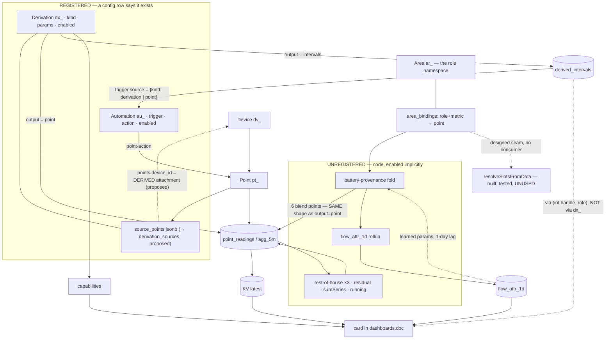

# The block model

> **Status:** proposed · drafted 2026-09-10 · reviewed against the code 2026-09-10 · successor
> framing for [fold-on-the-resolver.md](fold-on-the-resolver.md) and
> [ha-parity-and-leapfrog.md](ha-parity-and-leapfrog.md) §11

## The idea

Every mechanism that turns signals into other signals is a **block**: a config row with typed input
ports, typed output ports, params, optional state, and optional actions. Wiring is an **edge** from
an output port to an input port, legal only when the types are compatible. Role names resolve within
an **area**, which is what makes most wiring inferable.

Config-v4 built this for two mechanisms and called them `derivations`. The control plane built it
again for one more and called it `automations`. Eleven more compute derived signals as code with
implicit enablement. The model is not new — the coverage is the gap.

## The type

A port's type is a tuple over four axes. Two exist today; two are implicit and doing real work anyway:

| Axis | Values | Where it lives today |
| --- | --- | --- |
| **metric** | power · energy · soc · rate · temperature · speed · running | `points.metric_type` — bare `text`, no CHECK; the vocabulary lives in comments and predicates |
| **unit** | W · kWh · % · °C · rpm · c/kWh | `points.unit` — bare `text` |
| **shape** | series · intervals · matrix · scalar · event | implicit; `derivations.output` is a 2-value proxy |
| **accumulation** | instantaneous · cumulative-counter · delta | `points.transform` (`'d'` = differentiate a cumulative counter, `lib/point/point-manager.ts:830-891`) — which also carries `'i'` = invert, so one column conflates an accumulation class with a sign convention |

The last is HA's `state_class`, and it is why their Energy dashboard demands `device_class: energy`
**plus** `state_class: total_increasing`: "energy in kWh" is not a type; "monotonic counter of kWh"
is. We have the same distinction, hiding in `transform`.

**Role is not a type axis.** It is the namespace: it lives on the binding (`area_bindings.role`),
not on the point, and the scope rule below depends on that. The port type answers *can this wire
connect?*; the role answers *which compatible candidate is chosen*. Keep them apart, or the
predicate table becomes combinatorial and a builder cannot draw a wire without first knowing a role.

**Cadence is inherited, not typed.** 5m · 1d · latest · irregular is a property of the *table* a
signal was read from, and a block's output cadence is a function of its inputs' (Simulink's
sample-time inheritance). Making it a type axis would give every block four variants.

🛑 **Ports are asymmetric.** An *output* port carries a concrete type. An *input* port carries a
**predicate** over the tuple. The predicate half is already built — `lib/areas/slots.ts` expresses
input predicates as `matches: capability("ev/soc")` and `roleMetric("generator","power")`. The
resolution strategy is **not** on the port: it is global in `resolveSlotsFromData`, identical for
every slot. That is fine, and simpler than the alternative.

## The blocks

| Block | inputs | outputs | state | actions |
| --- | --- | --- | --- | --- |
| Device / vendor adapter | — (external) | N points | vendor cursor | write-points (`points.control`) |
| Run detector | signal, energy?, boundary? | interval-set + a `running` point | — | — |
| Model (HWS) | power | temperature series | warm-up | — |
| Fold (battery provenance) | battery power+soc, grid rate/EI/RF, solar | 6 series | **checkpoint + learned params, fed back** | — |
| Attribution | fold intensities + role-classified series | 1 matrix | — | — |
| Group-sum | N series | 1 series | — | — |
| Automation | interval-set or point | command stream | armed | ✅ **registered today** |
| Card | series / intervals / matrix | pixels | UI state | invokes actions |

Cards are terminal blocks. That unification is worth taking: a card is a block with inputs and no
signal outputs, so "is this card eligible?" becomes "do its input ports resolve?" — which is what the
capability layer is approximating today with a hand-maintained predicate table
(`lib/capabilities/catalog.ts`). Two caveats. Cards are blocks in the *type system*, not rows in the
registry — they live inside `dashboards.doc` and stay there. And the catalogue's own rule holds:
eligibility ≠ render authority; every renderer keeps its final gate.

## The edge

Today there are four encodings of "this feeds that":

| Edge | source | sink |
| --- | --- | --- |
| `area_bindings` | a point | an area's role slot |
| `derivations.source_points` (→ `derivation_sources`, proposed) | a point | a detector input |
| `automations.trigger.source` | a derivation **or** a point | the trigger |
| a card in `dashboards.doc` | `(int handle, role)` | the card |

A visual builder draws exactly one thing: **(source block, output port) → (sink block, input
port)**. So the model has one edge shape, and every increment conforms to it:

- an edge **source** is `pt_` (every series output *is* a point — the fold's six blend points, the
  HWS temperature, `<stem>/running` already are) or `(dx_, port)` for interval and matrix outputs,
  which are not points and never will be (see *What to resist*);
- an edge **sink** is always `(block, port)`. A device is a block with output ports only. An area's
  role slot is a named input port on the area.

`automations.trigger.source = {kind:"derivation"} | {kind:"point"}` is already this shape. It is the
precedent, not the future.

## How a port gets bound

Four modes, in precedence order. This is `resolveSlotsFromData` (`lib/areas/resolution.ts`), which is
already built, pure, tested and served at `GET /api/v4/areas/{id}/resolution` — **and called by
nobody** except that route:

1. **explicit** — a stored binding names the point; lowest `priority` wins.
2. **auto** — exactly one candidate in scope shape-matches. Sole match only: two candidates is
   reported as `absent` with `reason: "ambiguous"` and the candidate list, never a guess.
3. **config** — the port is satisfied by a value in config rather than a stream. Already real:
   `batteryProvenance.generatorSource.pricePerKwh` satisfies `grid/rate`.
4. **absent** — the block degrades or does not run.

So a port's source is `point | config | null`, and ambiguity is modelled as absence-with-evidence.

**Extend the slot catalogue to interval shapes.** `generator/runs` and `ev/runs` (shape: intervals)
resolve by role exactly as `generator/power` does, with an explicit `dx_` pin available for the
ambiguous case. That is how cards drop `(int handle, role)` without inventing a second addressing
scheme — see increment 5.

## The scope rule

**Role belongs to the binding, not the point.** Daylesford's inverter AC-input is `generator`, not
`grid`, purely by config; the same physical point can carry different roles in two areas. So an input
port never says "the solar point" — it says "this area's solar slot". That is exactly why auto-wiring
works and why it is bounded.

## The history rule

Blocks divide by whether their output is **recomputable** or **stored-and-stamped**:

- **Recomputable** (live series, KV latest) — re-wire freely; the next pass corrects everything.
- **Stored** (intervals carrying a `signal_unit` stamp; `flow_attr_1d` rows carrying a version) — a
  re-wire changes what *existing rows mean*.

This is already the operative rule — migration 0055 gave every interval its own `signal_unit` for
exactly this reason, and the derivation PATCH route refuses to re-point `sourcePoints`. But the route
also shows the rule is finer than per-block: it *does* permit re-pointing `boundary`
(`app/api/v4/areas/[id]/derivations/[dxid]/route.ts:29-33`), because a boundary changes where two
adjacent runs divide, not what the stored numbers measure. So:

**`pinned` is a property of the input port.** A run detector's `signal` and `energy` ports are
pinned; its `boundary` port is not. A builder renders a pinned port with a lock. Re-binding a pinned
port is not a config edit: it is either a **new block identity** (a new `dx_`, old rows stay with the
old one) or a **scoped recompute** of the whole affected range. Never a version bump that "must not
be mixed" — the algorithm version (`detector_version`, `FLOW_ATTR_VERSION`) says which *code*
produced a row; it is not a wiring revision, and overloading it would make both unreadable.

**Corollary, and it contradicts the clean sheet.** §4.3 says the resolver serves every consumer
including derivations. For a **pinned** port that is wrong: a slot-resolved input silently re-points
itself when someone reorders bindings, rewriting the meaning of a year of rows with no recompute. So
pinned ports name a **raw point**; unpinned ports resolve a **slot**. The resolver is right for the
fold and for cards, and wrong for a run detector's signal.

## The state rule

Some blocks are folds over time, not maps. A block declares itself `pure | stateful |
stateful-with-feedback`:

- **pure** — output at t depends only on inputs at t. Most blocks.
- **stateful** — carries state across intervals; needs a checkpoint. The HWS model's warm-up.
- **stateful-with-feedback** — 🛑 **the fold, and only the fold.** Its per-day learned parameters (η,
  capacity, charge efficiency, idle loss, reserve floor) are fitted from its *own* output history and
  applied to the next day, with `battery_provenance_daily.fold_state` as the checkpoint. That is a
  cycle with a one-day lag. It is the one thing that stops this being a DAG, and it must be declared
  rather than discovered. Under the history rule the fold's *outputs* are recomputable, but its
  *learned params* are not: a re-wire obliges a re-learn from the checkpoint, not just a re-run.

## The graph report

`resolveSlotsFromData` is a report over one area and its slots. Generalised to the whole graph it
becomes the artefact a visual builder actually consumes, and it is read-only:

- every edge type-checked against the port predicates;
- every unresolved and ambiguous port listed with its candidates;
- every cycle other than the one declared `stateful-with-feedback` flagged;
- every pinned port whose stored rows predate its current binding flagged.

Node-RED's "deploy" is the analogue: an atomic, validated commit of the graph. HA has no such thing —
a broken helper reference is discovered when the entity goes `unavailable`.

## What to resist

- **"Everything is points."** Attribution's output is a matrix keyed `(area, day, source, load)`
  because N² points would be absurd. The shape axis is load-bearing, not a wart.
- **Auto-wiring pinned ports.** See the history rule.
- **Inferring roles from metric+unit alone.** HA had the chance and declined: the Energy dashboard
  filters the picker by `device_class`/`state_class` but still makes you *assign* grid-consumption vs
  return-to-grid by hand. Two solar inverters and "obvious" stops being obvious — which is precisely
  what the resolver's `ambiguous` verdict already models.
- **Putting role or cadence in the port type.** See *The type*.

## What it buys

- Every producer gets `enabled`, `params`, a discoverable identity, and an answerable "what feeds
  this?" — currently answerable only by reading code for 11 of the 13.
- Backfill becomes uniform: a new block computes its **whole history**, which is the leapfrog HA
  structurally cannot do (helpers only produce data from the moment you create them).
- New kinds need no new table, API or flag — the clean sheet's stated goal, achieved for 2 of ~13.
- Card eligibility becomes derivable instead of a hand-maintained capability map.
- One edge shape means one builder canvas, one graph report, and one place to type-check.

**Composite blocks (deferred).** Real encapsulation — "the Daylesford generator pricing setup" as a
reusable unit — is a subgraph with exposed ports: Node-RED's subflow, HA's blueprint, Simulink's
subsystem. Nothing here builds it and nothing here should. What the edge rule guarantees is that
nothing *precludes* it: if every edge is block-port to block-port, a composite is just a block whose
ports forward to inner ports. An area is a namespace, not a composite, and stays that way.

## How this differs from Home Assistant

HA is a **global mutable namespace with name references**, not a typed graph:

- Entity state is a **string, max 255 characters** — even numbers come back as text. There is no
  value type system at runtime.
- Helpers subscribe to `entity_id`s by name; automations subscribe to state-change events; cards read
  `entity_id`s by name. Nothing declares a port.
- Compatibility exists only as a **UI picker filter** — the entity selector filters by `domain`,
  `device_class`, `supported_features`; the docs do not claim runtime enforcement.

The exception is instructive: the **Energy dashboard** is the one HA feature with roles, and it is
`area_bindings` in all but name — hand-assigned, with only compatible statistics offered
(`device_class: energy` + `state_class: total|total_increasing`; `device_class: power` +
`state_class: measurement`; `device_class: battery` + `%`).

HA's looseness is both why its helper ecosystem is a crown jewel (anything can consume anything) and
why it cannot type-check, cannot backfill, and why users bolt on Node-RED for real dataflow. Node-RED
has the shape — nodes, ports, subflows, an atomic deploy — but is untyped and has no history: a
re-wired flow has no notion that yesterday's output meant something else. Nearest relatives to this
model: signal-flow graphs (LabVIEW, Simulink, Houdini) and typed data DAGs (dbt).

Refs: [HA states](https://www.home-assistant.io/docs/templating/states/) ·
[Entity dev docs](https://developers.home-assistant.io/docs/core/entity/) ·
[Energy: electricity grid](https://www.home-assistant.io/docs/energy/electricity-grid/) ·
[Blueprint selectors](https://www.home-assistant.io/docs/blueprint/selectors/)

## Where we actually are

`point_readings`/KV is the universal currency and everything producing it plugs in. The unregistered
box produces the *same currency* in the *same shape* — the fold literally writes six ordinary points,
and `lib/battery-provenance/register.ts` says it is following "the HWS/run-tracking derived-point
pattern … NO new table/API/flag". What it lacks is a row saying it exists, so it has no `enabled`, no
`params`, no identity, and its config is scattered across `devices.config`, an `areas.config`
"pre-cutover compatibility" mirror, and code constants.

| Producer | Enabled by | Registered? |
| --- | --- | --- |
| HWS model · run detectors | a `derivations` row | ✅ |
| EV charge limits | an `automations` row | ✅ |
| Battery-provenance fold (6 blend points) | "the helper points exist" | ❌ code |
| `flow_attr_1d` rollup | "every complete logical system" | ❌ code + `FLOW_ATTR_VERSION` |
| The learn (5 fitted params/day) | "has a battery binding" | ❌ code |
| `load.rest-of-house` | role classification | ❌ **code, three times** — `flow-series.ts` and `site-data-processor.ts` agree; `tiles/shared.tsx` differs (no generation case, string-scan child discovery, null instead of clamp-to-zero); plus an energy-side rule in `flow-series.ts` |
| `solar.residual` · `sumSeries` · `<stem>/running` · `transform` | assorted | ❌ code |
| `DERIVATION_INPUTS` suppression map | a hand-maintained `Map` | ❌ exists *because* rest-of-house is derived more than once; records a prod incident |

Two selectors, two columns: the fold picks its inputs by `Array.find` over bindings ordered by
`ordinal`; the resolver picks by `priority`. They are independent columns on the same table, so the
`/resolution` report and the fold can disagree today and nothing notices. Adopting the resolver is a
semantic change on real sites, not a refactor — [fold-on-the-resolver.md](fold-on-the-resolver.md)
has the enumeration.

## Increments, in order of payoff

1. **Detectors attach to devices via their sources** (Part 2). Turns `source_points` into a real
   typed port table (`derivation_sources`) and kills the last area coupling. In flight. Note the
   divergence it opens: `derivations.area_id` goes, `automations.area_id` stays `NOT NULL` — decide
   whether automations follow, and write it down either way.
2. **The graph report.** Generalise `resolveSlotsFromData` from one area's slots to every edge in
   the registered graph, read-only, served over HTTP. Cheap, and it is the thing a builder renders.
   Doing it before the fold moves means the fold's move is verified by the report, not by eye.
3. **The fold becomes `kind: 'battery-provenance'`, `output: 'point'`.** It already produces points
   in the derivation shape; it lacks only the row — which would give it `enabled`, a `params` home
   for constants currently split across two config mirrors and code, and ports instead of a
   hand-rolled `Array.find` over bindings. Requires declaring `stateful-with-feedback`.
4. **Adopt the resolver.** Move the fold's input selection from `Array.find`-over-`ordinal` to
   `resolveSlotsFromData`. 🛑 This obliges the matching move in `lib/run-tracking/intensity.ts` in
   the *same* change, and it changes which point feeds any site whose `ordinal` and `priority`
   orders disagree — see fold-on-the-resolver.md.
5. **`group-sum` as a kind.** Retires all three `rest-of-house` implementations *and* the
   `DERIVATION_INPUTS` map that papers over them.
6. **Cards resolve interval slots.** Add `generator/runs` and `ev/runs` to the slot catalogue so a
   card binds by role with an optional explicit `dx_` pin — the same shape `automations` already
   uses. Retires the role→capability map, the mirrored role lists, the pinning contradiction, and
   the int-addressed `run-periods` endpoint.
7. The `flow_attr_1d` rollup — hardest, because it is per-area rather than per-point.
