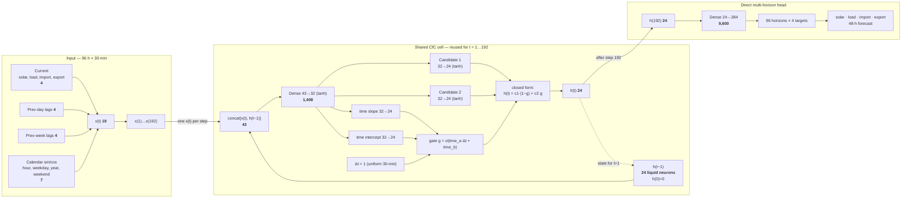

# A compact CfC as the forecaster in a real home-battery controller

**A three-page technical briefing — Kinkora residential energy system, Australia · August 2026**

We put a reference-implementation **closed-form continuous-time (CfC)** network into the forecasting slot
of a real prosumer battery controller and evaluated it *by the money it saves*, not by forecast error —
against the home's actual behaviour under Amber Electric's production optimiser, against parameter-matched
GRU/LSTM controls, and against a perfect-foresight oracle. On a complete ~10-month **production** dataset,
the 24-neuron CfC **beats the incumbent controller and both matched recurrent networks** — but a **trivial
same-time-yesterday baseline beats the CfC**, even though the CfC has the *best price-forecast accuracy of
any model*. That dissociation, and the fact that the ranking flips between data windows, are the results
worth discussing. Full write-up in [`PAPER.md`](PAPER.md); measured numbers in [`RESULTS.md`](RESULTS.md).

---

## 1. The problem domain

A home with rooftop solar and a ~21–34 kWh battery on a **wholesale (Amber) 30-minute tariff** is a small
energy trader. Import and export prices both move every 30 minutes and both can go **negative** (you are
sometimes paid to import and charged to export). A battery shifts energy across intervals subject to
efficiency, power, capacity, reserve, and inverter limits. So "use your own solar first" is *not*
cost-optimal: it can be rational to grid-charge ahead of a price spike, to deliberately export the
battery, or to forgo feed-in revenue to store cheap energy. The controller must choose **before** future
solar, load, and price are known.

We frame this as **model-predictive control**: forecast a 48-hour horizon, solve a linear program for the
optimal power flows, execute only the first 30-minute action, then re-solve. **The CfC never decides when
to charge or discharge** — its sole job is to *forecast* the next 48 h; a separate, deterministic **linear
program** makes the dispatch decision from those forecasts and the battery's physical constraints. The
**forecaster is the one swappable component** — everything downstream (the LP, the battery physics, the
realised-cash scoring) is held byte-identical across models, so any cost difference is attributable to
forecast quality alone. This
is a **simulation/backtest** against the home's real recorded operation — no live control. The incumbent
comparator is Amber's **SmartShift**, itself a forecast-aware, CSIRO-assisted production optimiser — a
strong baseline, not a strawman.

## 1b. The data we have to play with

- **One home, ~10 months, production data, no synthesized prices**: 14,467 contiguous 30-minute intervals,
  19 Oct 2025 – 16 Aug 2026, read from the **production** database (an earlier dev-mirror snapshot had a
  multi-month price gap; this run has none). Neural evaluation uses only the held-out final 20%
  (24 Jun – 14 Aug 2026, ≈ 52 days).
- **Four coupled forecast targets**: solar generation, household load, Amber import price, Amber export
  price — plus battery state and grid flow.
- **Physically grounded battery model** from a per-day learned "fold": usable capacity 21→34 kWh (a real
  mid-window expansion), charge efficiency 0.97–1.00, round-trip η ≈ 0.90, idle loss 0.43–1.02 kWh/day,
  learned reserve floor 5–10%, ~8.5 kW power.
- **Validated cost model (trust gate).** Our realised-cash function reproduces Amber's *own billing* to
  correlation **0.999** (~$0.14/day absolute), and the physics reconstruction tracks the coulomb-counted
  stored energy to ~0.9 kWh/day. Load is reconstructed from a verified site balance `load = solar + grid + battery`.
- **Honest limits.** A 7-month SoC-sensor gap is filled offline from the derived stored-energy signal.
  Amber's historical forecast vintages are not retained (only ~40 h exist), so there is no honest
  "Amber-own forecast" baseline; all models forecast from **settled history only**.

## 2. The network design

The principal model is the **dense `ncps` CfC** (not an AutoNCP sparse wiring). A **24-neuron liquid
recurrent state** consumes 96 hours of history (192 steps × 19 features) and a **direct multi-horizon
head** decodes the final state into **96 horizons × 4 targets** (a full 48-hour forecast) in one shot.
"24 neurons" is the recurrent state only; the whole forecaster is **14,176 parameters** (4,576 in the
shared cell, reused across all 192 steps). Features are 4 current values + 4 same-time-yesterday lags + 4
same-time-last-week lags + 7 cyclical calendar terms. Trained with AdamW + Smooth-L1, chronological
60/20/20 split (4,029 / 2,461 / 2,462) with a **one-week purge/embargo**, validation early stopping,
fixed seed. **Inference: 0.31 ms per origin.**

| Component | Connectivity | Params |
|---|---:|---:|
| Shared CfC cell (backbone + 2 candidates + 2 time branches) | reused ×192 | 4,576 |
| Direct forecast head | 24 → 384 | 9,600 |
| **Total** | | **14,176** |

## 3. Our results so far

**Forecast accuracy (held-out MASE) — no model dominates:**

| Model | Solar | Load | Import price | Export price | Params |
|---|---:|---:|---:|---:|---:|
| **CfC** | 1.154 | 1.838 | **1.367** | 1.242 | 14,176 |
| GRU | 1.116 | 1.799 | 1.391 | 1.242 | 14,034 |
| LSTM | 1.179 | **1.792** | 1.397 | **1.241** | 13,920 |
| Previous-day | **0.453** | 2.058 | 1.439 | 1.436 | 0 |
| Persistence | 1.370 | 2.489 | 2.543 | 1.360 | 0 |

**Held-out economic dispatch (realised cash, ≈52 test days):**

| Policy | Cost | vs incumbent |
|---|---:|---:|
| Perfect-forecast oracle | **$588.35** | +$103.41 |
| **Previous-day + MPC** | **$654.38** | **+$37.38** |
| CfC + MPC | $683.40 | +$8.36 |
| GRU + MPC | $691.34 | +$0.42 |
| Recorded incumbent (SmartShift-enabled) | $691.76 | — |
| LSTM + MPC | $731.22 | −$39.46 |
| Dumb self-consumption | $960.63 | −$268.86 |
| No battery | $1068.55 | −$376.79 |

The CfC beat the incumbent and both matched RNNs, but captured only ~8% of the $103 oracle headroom and
**lost to same-time-yesterday by $29**. Two findings matter more than the ranking:

1. **Economic value ≠ forecast accuracy — and here it cuts *against* the network.** The CfC had the *best
   import-price MASE of any model* (1.367) yet produced dearer dispatch than a trivial previous-day rule.
   The reason is **solar**: previous-day nails the daily PV cycle (MASE 0.453 vs the CfC's 1.154), and
   battery dispatch value is dominated by getting the solar/load *shape* right, not price. Aggregate MASE
   across targets does not see this — it argues for **evaluating and training through the decision**.
2. **The result is not robust — we claim no liquid-network advantage.** On a shorter earlier window
   (46 held-out days, Oct–Mar data) the CfC was the *cheapest* forecaster and beat previous-day by $6.85;
   on the complete data with a later ≈52-day window it *trails* by $29. The day-bootstrap 95% CI for
   CfC-minus-previous-day spans zero (−$1.96 to +$0.41/day): the two are statistically indistinguishable
   and window-sensitive. Even a **perfect 24-hour price forecast** moves the CfC's realised cost by under
   3% and *flips sign* between windows (−$20 earlier, +$9 now) — confirming price is second-order to
   solar/load shape here.

**What is robust:** forecast-aware constrained control beats price-blind self-consumption by ~29%; the CfC
beats the incumbent and both parameter-matched RNNs; and a 24-dimensional liquid state at **0.31 ms/origin**
runs the full control loop with no solver failures. Over the full 300-day window the battery itself is
worth **$1,425** versus no battery, with **$394** of perfect-foresight headroom for any forecaster to chase.

## 3b. Possible future directions

- **Add a causal weather feature (the biggest lever).** The CfC's weakness is *solar shape*. Feed
  leakage-safe archived **forecast vintages** — Open-Meteo/BOM ACCESS-G `previous_day1` GHI, which covers
  this window — calibrated to Kinkora PV on training data only. This is the most plausible path to beat
  the previous-day baseline.
- **Decision-focused training.** Train on realised cash (or price-spike probabilities) rather than
  Smooth-L1 forecast error; couple with **probabilistic / robust MPC over coherent joint scenarios** of
  price, solar, and load — targeting the accuracy-vs-value gap directly.
- **Isolate the liquid contribution properly.** The single-seed, single-site ranking is not robust; repeat
  across seeds, homes, and seasons before attributing anything to liquid recurrence. Explore **AutoNCP
  sparse wiring** for interpretability of the learned circuit.
- **Richer physics & second asset.** Add battery degradation/cycle cost to the objective; extend to the
  home's **Tesla EV** (a large, flexible, deferrable load already in the dataset).
- **Toward deployment.** A prospective **online shadow trial** against SmartShift with matched reserves,
  constraints, and *preserved forecast vintages* is the decisive next experiment. For edge/browser
  inference there is no maintained JS/WASM `ncps` port; the pragmatic path is a single-step **ONNX export**
  under `onnxruntime-web`, or a hand-ported CfC cell parity-tested against PyTorch.

---

*Model: reference `ncps` CfC (Lechner et al.). Method: Hasani et al., "Liquid Time-constant Networks"
(AAAI 2021) and "Closed-form continuous-time neural networks" (Nature Machine Intelligence 2022). This is a
single-site retrospective case study, not a product claim; "SmartShift" is a trademark of Amber Electric.*
