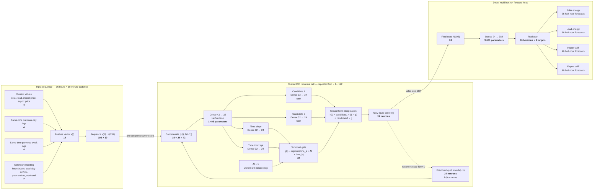

# CfC neural-network connectivity

This is the exact fully connected `ncps` CfC used by `CfCDirect`. Dimensions omit the batch axis.
Weights inside the CfC cell are shared across all 192 recurrent steps.

## Parameter accounting

| Component | Connectivity | Parameters |
|---|---:|---:|
| CfC backbone | `43 → 32` | 1,408 |
| Candidate 1 | `32 → 24` | 792 |
| Candidate 2 | `32 → 24` | 792 |
| Time slope | `32 → 24` | 792 |
| Time intercept | `32 → 24` | 792 |
| **Shared CfC cell subtotal** | reused for all 192 steps | **4,576** |
| Direct forecast head | `24 → 384` | 9,600 |
| **Entire network** | | **14,176** |

The 24 recurrent-state units are the liquid neurons. The 32 backbone units and 384 output values are
ordinary feed-forward units, not additional liquid neurons. This model uses dense CfC connectivity,
not an `AutoNCP` sparse wiring.
