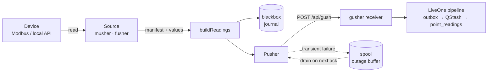

# usher

> **Status:** current — the live on-site collector. Deployable to a **Fly hub** (`liveone-flyhub`,
> where it runs today) or to a **Raspberry Pi** on the site LAN, from the same build.

The **usher** is LiveOne's on-site reader: a small Next.js app that runs _near_ the hardware, polls
devices over their LAN protocol, and pushes self-describing readings to the LiveOne cloud. It also
serves a live inspector dashboard.

## Why this exists

Most LiveOne vendors are polled from the cloud on a Vercel cron. Some devices **cannot be**: a Deep
Sea generator controller speaks Modbus TCP on a private LAN behind CGNAT, with no public address and
no vendor cloud. For those, polling from the cloud is not slower — it is structurally impossible.

So the direction inverts. A collector runs on-site (or on a Fly hub tunnelled into the site), does
the polling itself, and **pushes** the results out to `POST /api/gush`. Everything downstream is
unchanged: pushed readings enter the same pipeline as polled ones.

## Where it runs — two targets, one build

The usher is deliberately **deploy-target agnostic**. The same code, the same `usher.yaml` and the
same standalone build run in either place:

|                              | **Fly hub** (`liveone-flyhub`)                                      | **Raspberry Pi**                       |
| ---------------------------- | ------------------------------------------------------------------- | -------------------------------------- |
| Where                        | Fly.io, region `syd`                                                | on the site LAN                        |
| Reaches devices              | over WireGuard — the site's UniFi gateway dials in as a WG client   | directly, no tunnel                    |
| Device hosts in `usher.yaml` | the same LAN IPs, routed over the tunnel                            | the same LAN IPs                       |
| Runs as                      | container `ENTRYPOINT` (WireGuard + cloudflared + `node server.js`) | a systemd unit                         |
| Persistent store             | Fly volume at `/data`                                               | a directory on the SD card / SSD       |
| Sites per host               | many — one hub can serve several sites at once                      | one (the LAN it sits on)               |
| Guide                        | [docs/deploy-fly.md](docs/deploy-fly.md)                            | [docs/deploy-pi.md](docs/deploy-pi.md) |

Nothing in the application code branches on the target: there are no Fly APIs, no `FLY_*` env reads,
and no tunnel logic anywhere in `core/`, `sources/` or `clients/` — WireGuard is set up entirely by
the Fly image's `entrypoint.sh`, outside the app. A source simply connects to a `host:port`; whether
that address is reachable because the machine is _on_ the LAN or because it is _tunnelled into_ the
LAN is not the collector's concern. The dependencies are portable too — `modbus-serial` needs its
native `serialport` optional dependency only for real serial ports, never for Modbus **TCP**.

**Which is live today:** the Fly hub, serving both sites. The Pi recipe is complete and supported,
and was the original deploy target for the predecessor (FroniusPusher), but no usher is running on a
Pi right now — treat `docs/deploy-pi.md` as tested-by-construction rather than continuously
exercised.

Choose the Pi when the site already has an always-on box on the LAN and you want no tunnel to
maintain. Choose the Fly hub when the site is behind CGNAT (no inbound path), when you would rather
not own hardware on site, or when one host should serve several sites.

## The names

The family naming is the one real barrier to reading this package:

| name       | what it is                                                         | where                                                |
| ---------- | ------------------------------------------------------------------ | ---------------------------------------------------- |
| **usher**  | the host app — config, scheduling, journalling, pushing, inspector | this package                                         |
| **musher** | source plugin for the Deep Sea DSE7410 genset (**M**odbus)         | `sources/musher.ts`                                  |
| **fusher** | source plugin for **F**ronius inverters                            | `sources/fusher.ts`                                  |
| **gusher** | the receiver — generic, self-describing, vendor-agnostic           | `app/api/gush/route.ts` (the **main app**, not here) |

The wire contract between usher and gusher is [`@liveone/protocol`](../protocol/README.md) — the only
thing this package shares with the LiveOne app.

## It cannot lose a batch

That is the point of the design, and it is worth stating up front:

- every collected batch is journalled to the **blackbox** _before_ the push is attempted;
- a push that fails transiently is buffered in the **spool** on a persistent volume, and re-sent
  automatically the next time the receiver acks;
- a full or broken disk degrades both stores — it never stops collection.

The mechanics, and why re-sends are safe, are in [docs/architecture.md](docs/architecture.md#the-durability-model).
Operational triage is in [docs/operations.md](docs/operations.md#store-triage).

## Pipeline



The receiver is idempotent on `(systemId, pointId, measurementTime)`, which is what makes a spool
re-send safe to repeat.

## Layout

| path                                             | what                                                                                                                                          |
| ------------------------------------------------ | --------------------------------------------------------------------------------------------------------------------------------------------- |
| `core/`                                          | everything shared by all sources — the reason a source can stay tiny                                                                          |
| `core/source.ts`                                 | **the Source contract**: a manifest + `read()`. Start here                                                                                    |
| `core/config.ts`                                 | `usher.yaml` schema (zod) — the source of truth for configuration                                                                             |
| `core/factory.ts`                                | config `type` → concrete source + its cadence. The only place that mapping lives                                                              |
| `core/run.ts`                                    | the run loop: tick, boundary alignment, active cadence, tick timeout                                                                          |
| `core/pusher.ts`                                 | the gusher client — retry/backoff and the three-way push outcome                                                                              |
| `core/blackbox.ts`                               | the flight recorder (daily JSONL journal)                                                                                                     |
| `core/spool.ts`                                  | the outage buffer (undelivered batches)                                                                                                       |
| `core/build.ts`, `core/disk.ts`, `core/usher.ts` | reading assembly, fs helpers, runtime wiring                                                                                                  |
| `sources/`                                       | the device sources — `musher.ts` (DeepSea), `fusher.ts` (Fronius)                                                                             |
| `clients/`                                       | protocol clients: `dse-client.ts` (Modbus/GenComm), `fronius/` (inverter + site)                                                              |
| `app/`, `state/`                                 | the inspector dashboard and its SSE/JSON routes                                                                                               |
| `cli.ts`                                         | run or dry-run the collector without the server                                                                                               |
| `instrumentation.ts`                             | starts the collector when the Next.js server boots                                                                                            |
| `docs/`                                          | [architecture](docs/architecture.md) · [operations](docs/operations.md) · [deploy: Fly](docs/deploy-fly.md) · [deploy: Pi](docs/deploy-pi.md) |

## Quick start

From the repo root:

```bash
npm ci
cp packages/usher/usher.example.yaml packages/usher/usher.yaml   # edit hosts for your deployment
npm run --workspace @liveone/usher usher -- --dry
```

`--dry` reads each configured source once and prints the reading set it _would_ push — no API key,
no network to gusher. It is the fastest way to confirm a device is reachable and a manifest is
right.

```bash
npm run --workspace @liveone/usher usher -- --once    # one tick per source (read → push), then exit
npm run --workspace @liveone/usher usher              # the loop
npm run --workspace @liveone/usher dev                # the Next.js server; the loop autostarts, inspector on :3000
```

Config path resolves `--config <path>` → `$USHER_CONFIG` → `./usher.yaml`.

## Configuration

`usher.yaml` describes the sources one deployment manages. The **schema is the source of truth** —
see `core/config.ts` (zod, commented) and `usher.example.yaml` (a working template). The same file
shape works on Fly (devices reached over WireGuard) and on a Pi (devices on the LAN); only the hosts
differ.

Secrets never go in the file: each source names an env var via `apiKeyEnv`, and that var holds the
device's `gk_` gusher key.

### Environment

| var                         | what                                                                                                               |
| --------------------------- | ------------------------------------------------------------------------------------------------------------------ |
| `USHER_CONFIG`              | path to `usher.yaml` (default `./usher.yaml`)                                                                      |
| `USHER_DATA_DIR`            | store root for `blackbox/` + `spool/`. Overridden by `dataDir` in the config; defaults to `./.usher-data`          |
| `USHER_AUTOSTART`           | set `false` to boot the server without starting the collector                                                      |
| `HOSTNAME` / `PORT`         | server bind (`127.0.0.1:3000` in the Fly image — cloudflared fronts it)                                            |
| _(per source)_              | the var named by that source's `apiKeyEnv`, e.g. `MUSHER_API_KEY`, `KINKORA_API_KEY`                               |
| `MUSHER_DIAGNOSTICS`        | `1` = capture the full DeepSea register dump every poll — see [operations](docs/operations.md#deepsea-diagnostics) |
| `MUSHER_DIAG_POSTRUN_SECONDS` | seconds to hold the fast cadence after a run ends (default 3600). Was `…_TICKS`, a tick count, which rescaled itself whenever the poll cadence changed |

## Deploy

- **[docs/deploy-fly.md](docs/deploy-fly.md)** — the production hub: a Fly machine that is also a
  multi-peer WireGuard server, with both sites' UniFi gateways dialling in as clients.
- **[docs/deploy-pi.md](docs/deploy-pi.md)** — the simple case: a Raspberry Pi on the site LAN, no
  tunnel needed.

## Tests

```bash
npm test -- packages/usher
```

Covers the run loop, spool and blackbox (`core/__tests__/`) and the Fronius source
(`sources/__tests__/`).
